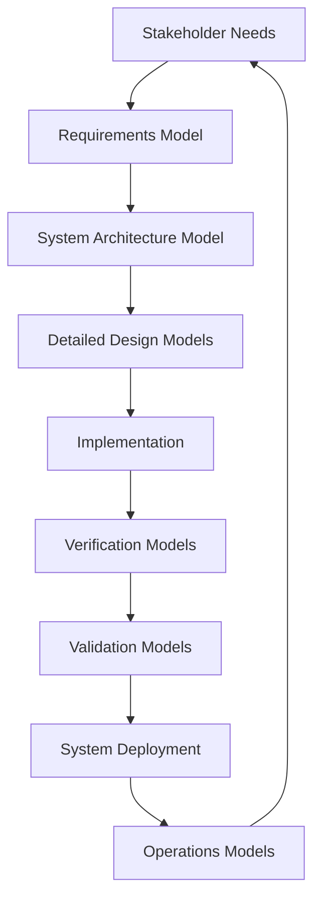

# MOSA and MBSE Guidelines for Constellation Overwatch

**Document Version**: 1.0  
**Last Updated**: January 30, 2025  
**Purpose**: Establish Modular Open Systems Architecture (MOSA) and Model-Based Systems Engineering (MBSE) principles for Constellation Overwatch development

## Table of Contents

1. [MOSA Principles and Implementation](#mosa-principles-and-implementation)
2. [MBSE Methodology Framework](#mbse-methodology-framework)
3. [Architectural Standards](#architectural-standards)
4. [Documentation Requirements](#documentation-requirements)
5. [Development Workflow](#development-workflow)
6. [Quality Assurance](#quality-assurance)

## MOSA Principles and Implementation

### Definition

**Modular Open Systems Approach (MOSA)** is an integrated business and technical strategy that employs a modular design with defined interfaces between modules and uses open interfaces defined by widely supported standards (DoD Reference: 10 U.S.C. 2446a).

### Core MOSA Principles for Constellation Overwatch

#### 1. Establish an Enabling Environment
- **Implementation**: Create supportive development practices and deployment strategies
- **Constellation Overwatch Application**: 
  - Containerized development environment with Docker
  - Standardized CI/CD pipelines
  - Open source licensing (Apache 2.0)
  - Community-driven contribution model

#### 2. Employ Modular Design
**Four Core Tenets**:
- **Cohesive**: Well-focused functionality within each module
- **Encapsulated**: Internal workings hidden behind clear interfaces  
- **Self-contained**: Modules don't constrain other modules
- **Highly binned**: Broad definitions enabling commonality and reuse

**Constellation Overwatch Implementation**:
```
constellation-overwatch-sdk/
├── sdk/core/                   # Core functionality (cohesive)
├── sdk/ai/                     # AI services (encapsulated)
├── sdk/communication/          # Communication protocols (self-contained)
├── sdk/plugins/                # Extensible modules (highly binned)
└── sdk/api/                    # Standard interfaces
```

#### 3. Designate Key Interfaces
- **Key Interfaces**: Between major system components requiring openness
- **Non-Key Interfaces**: Internal interfaces that may remain proprietary

**Constellation Overwatch Key Interfaces**:
- API Layer (FastAPI-based HTTP endpoints)
- Message Bus (Async Pub/Sub communication)
- Plugin System (Extensible module loading)
- Hardware Abstraction Layer (Vehicle controllers, sensors)

#### 4. Use Open Standards
**Mandated Standards**:
- **Communication**: MAVLink 2.0, ROS 2, DDS, WebSocket
- **Data Formats**: JSON, GeoJSON, KML, OpenAPI 3.x
- **Security**: OAuth 2.0, JWT, TLS 1.3, PKI standards
- **Documentation**: OpenAPI, JSON Schema, Markdown

#### 5. Certify Conformance
- **Verification Methods**: Automated testing, integration testing, conformance validation
- **Implementation**: CI/CD pipelines with compliance checking

### MOSA Taxonomy Levels (MIL-STD-881D Alignment)

Following DoD guidance, we implement MOSA at appropriate taxonomy levels:

**Level 1: System of Systems (Mission Engineering)**
- Joint force coordination
- Multi-platform integration
- Cross-domain interoperability

**Level 2: Platform/System (Primary Focus)**
- Constellation Overwatch SDK
- Individual drone platforms
- Ground control systems

**Level 3: Subsystem/Component**
- AI modules
- Communication subsystems
- Sensor interfaces

**Level 4: Software Components**
- Microservices
- Plugin modules
- API endpoints

## MBSE Methodology Framework

### Definition

**Model-Based Systems Engineering (MBSE)** is the formalized application of modeling to support system requirements, design, analysis, verification, and validation activities beginning in the conceptual design phase and continuing throughout development and later life cycle phases (INCOSE SE Vision 2025).

### MBSE Implementation Strategy

#### 1. Digital Engineering Integration
- **Authoritative Source of Truth**: System models as primary artifacts
- **Model-Driven Development**: Requirements traceability from models to code
- **Continuous Integration**: Models updated with system evolution

#### 2. Modeling Standards
- **Primary Language**: SysML 2.0 (when available)
- **Current Implementation**: SysML 1.x with migration planning
- **Supporting Standards**: UML, BPMN for specific domains
- **Documentation Models**: PlantUML, Mermaid for architecture diagrams

#### 3. Model Types and Applications

**Requirements Models**:
- Stakeholder needs definition
- System requirements specification
- Use case modeling

**Architectural Models**:
- System context diagrams
- Component interaction models
- Interface specifications

**Behavioral Models**:
- Activity diagrams
- State machine diagrams
- Sequence diagrams

**Analysis Models**:
- Performance models
- Safety/security models
- Trade study models

### MBSE Process Workflow



## Architectural Standards

### System Architecture Principles

#### 1. Layered Architecture
```
┌─────────────────────────────────────────┐
│            User Interfaces             │
├─────────────────────────────────────────┤
│              API Layer                  │
├─────────────────────────────────────────┤
│            Business Logic               │
├─────────────────────────────────────────┤
│            Data Access                  │
├─────────────────────────────────────────┤
│          Hardware Abstraction           │
└─────────────────────────────────────────┘
```

#### 2. Microservices Architecture
- **Service Independence**: Each service deployable independently
- **API-First Design**: Well-defined service interfaces
- **Data Sovereignty**: Services own their data
- **Fault Isolation**: Service failures don't cascade

#### 3. Plugin Architecture
- **Standard Interfaces**: Common plugin API
- **Lifecycle Management**: Plugin loading, unloading, updating
- **Security Sandbox**: Isolated execution environments
- **Metadata Standards**: Plugin description, dependencies, capabilities

### Interface Design Standards

#### 1. API Design
- **RESTful Principles**: Resource-based URLs, HTTP verbs
- **OpenAPI 3.x**: Machine-readable API specifications
- **Versioning Strategy**: Semantic versioning with backward compatibility
- **Error Handling**: Standardized error codes and messages

#### 2. Message Interfaces
- **Async Patterns**: Event-driven communication
- **Schema Registry**: Centralized message schema management
- **Topic Naming**: Hierarchical, standardized naming convention
- **Durability**: Persistent messaging for critical communications

#### 3. Plugin Interfaces
- **Discovery Mechanism**: Automatic plugin detection
- **Capability Declaration**: Plugin metadata and requirements
- **Lifecycle Hooks**: Initialize, start, stop, cleanup phases
- **Configuration Management**: Standardized configuration schemas

## Documentation Requirements

### API Documentation Standards

#### 1. Reference Documentation
**Requirements**:
- **Completeness**: All endpoints, parameters, responses documented
- **Accuracy**: Documentation matches implementation
- **Examples**: Working code samples in multiple languages
- **Interactive**: "Try it" functionality for testing

**Tools**:
- OpenAPI Generator for multi-language SDKs
- Swagger UI for interactive documentation
- Redoc for static documentation generation

#### 2. Developer Guides
**Structure**:
- Getting Started (Quick start guide)
- Authentication and Security
- Core Concepts
- Use Case Tutorials
- Best Practices
- Troubleshooting

#### 3. Architecture Documentation
**Requirements**:
- System context diagrams
- Component interaction diagrams
- Interface specifications
- Deployment diagrams
- Security architecture

### Wiki and Community Documentation

#### 1. Wiki Structure
```
wiki/
├── Getting-Started/
├── Developer-Guides/
├── API-Reference/
├── Architecture/
├── Contributing/
├── Troubleshooting/
└── Community/
```

#### 2. Content Standards
- **Clarity**: Simple, jargon-free language
- **Completeness**: Cover all use cases
- **Currentness**: Updated with each release
- **Consistency**: Standardized formatting and style

## Development Workflow

### Model-Driven Development Process

#### 1. Requirements Phase
1. **Stakeholder Analysis**: Identify all system stakeholders
2. **Use Case Modeling**: Define system interactions
3. **Requirements Specification**: Formal requirements documentation
4. **Traceability Matrix**: Link requirements to implementation

#### 2. Design Phase
1. **System Architecture**: High-level system design
2. **Interface Design**: Define all system interfaces
3. **Component Design**: Detailed component specifications
4. **Trade Studies**: Analyze design alternatives

#### 3. Implementation Phase
1. **Code Generation**: Where appropriate, generate from models
2. **Interface Implementation**: Implement defined interfaces
3. **Unit Testing**: Test individual components
4. **Integration Testing**: Test component interactions

#### 4. Verification Phase
1. **Model Validation**: Verify models against requirements
2. **Code Review**: Ensure implementation matches design
3. **Integration Testing**: System-level testing
4. **Performance Testing**: Validate system performance

### Version Control and Configuration Management

#### 1. Git Workflow
- **Main Branch**: Stable, production-ready code
- **Develop Branch**: Integration branch for features
- **Feature Branches**: Individual feature development
- **Release Branches**: Preparation for releases

#### 2. Model Management
- **Model Versioning**: Track model changes with code
- **Model Storage**: Store models in version control
- **Model Documentation**: Document model changes
- **Model Validation**: Automated model checking

## Quality Assurance

### Testing Strategy

#### 1. Model Testing
- **Model Consistency**: Check for modeling errors
- **Requirements Traceability**: Verify requirement coverage
- **Interface Validation**: Test interface definitions
- **Performance Analysis**: Model-based performance prediction

#### 2. Code Testing
- **Unit Tests**: Test individual components
- **Integration Tests**: Test component interactions
- **System Tests**: End-to-end system testing
- **Performance Tests**: Load and stress testing

#### 3. Documentation Testing
- **Link Validation**: Ensure all links work
- **Code Example Testing**: Verify code examples execute
- **API Documentation**: Test API examples
- **User Acceptance**: Validate documentation usability

### Continuous Integration

#### 1. Automated Testing
- Model validation on commit
- Code testing on pull requests
- Documentation generation and testing
- Security scanning

#### 2. Quality Gates
- **Code Coverage**: Minimum 80% coverage
- **Documentation Coverage**: All APIs documented
- **Model Coverage**: All requirements traced
- **Security Compliance**: No critical vulnerabilities

### Metrics and Monitoring

#### 1. Development Metrics
- **Requirements Traceability**: Percentage of requirements covered
- **Model Quality**: Model consistency and completeness scores
- **Code Quality**: Complexity, maintainability, test coverage
- **Documentation Quality**: Completeness, accuracy, usability

#### 2. Community Metrics
- **Adoption Rates**: Download and usage statistics
- **Community Engagement**: Issues, discussions, contributions
- **Documentation Usage**: Page views, search queries
- **Support Effectiveness**: Issue resolution time

---

## Implementation Roadmap

### Phase 1: Foundation (Weeks 1-4)
- [ ] Establish MOSA/MBSE documentation
- [ ] Define architectural standards
- [ ] Set up development environment
- [ ] Create initial system models

### Phase 2: Core Implementation (Weeks 5-12)
- [ ] Implement core architectural patterns
- [ ] Develop API documentation standards
- [ ] Create developer guides
- [ ] Establish testing frameworks

### Phase 3: Community Building (Weeks 13-20)
- [ ] Create wiki structure
- [ ] Develop contributor guidelines
- [ ] Implement feedback mechanisms
- [ ] Launch community programs

### Phase 4: Maturation (Weeks 21-26)
- [ ] Optimize based on feedback
- [ ] Enhance documentation
- [ ] Improve development tools
- [ ] Measure and improve quality

---

*This document serves as the foundational framework for implementing MOSA and MBSE principles in the Constellation Overwatch project. It should be updated regularly to reflect evolving best practices and project requirements.*