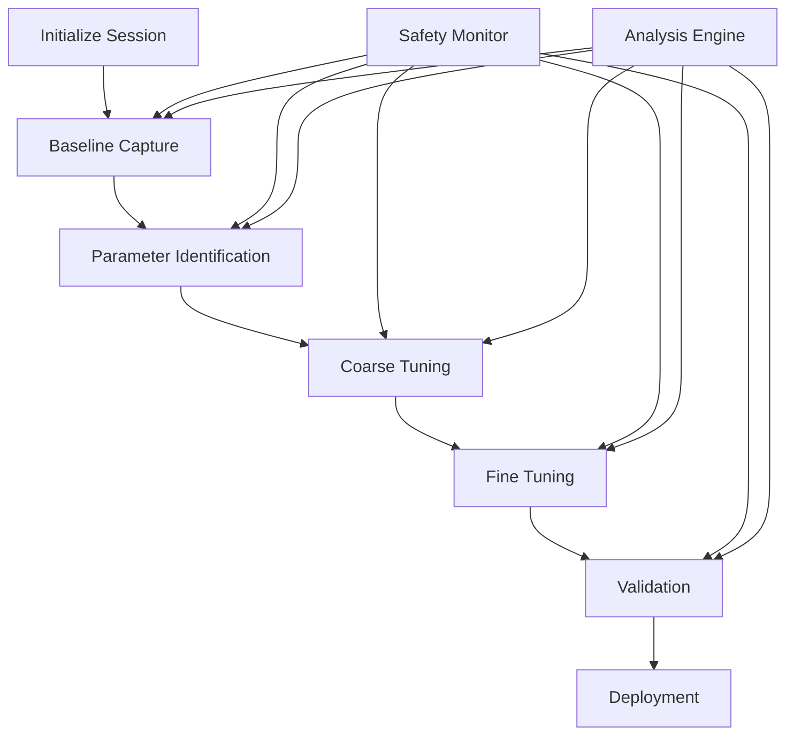

# Constellation Overwatch SDK - Autopilot Tuning Framework

## Overview

The Constellation Overwatch SDK includes a comprehensive autopilot tuning framework designed to provide professional-grade flight controller optimization capabilities. This system incorporates industry best practices from ArduPilot, PX4, and academic research to deliver reliable, automated tuning solutions.

## Key Features

### 🎛️ Advanced PID Control
- **Multi-form PID controllers** (parallel, standard, rate)
- **Anti-windup protection** with multiple strategies
- **Derivative kick prevention** for smooth operation
- **Performance monitoring** with real-time metrics

### 🔄 Automated Tuning
- **Relay feedback method** based on ArduPilot best practices
- **Frequency domain analysis** using PX4 methodologies
- **Ziegler-Nichols parameter calculation** with safety margins
- **System identification** algorithms for plant characterization

### 🛡️ Comprehensive Safety
- **Real-time oscillation detection** using frequency analysis
- **Multi-level safety monitoring** (Warning, Critical, Emergency)
- **Automatic parameter rollback** on safety violations
- **Rate limiting and saturation protection**

### 🧪 Simulation-Based Optimization
- **6-DOF drone dynamics** with realistic physics modeling
- **Genetic algorithm optimization** for parameter search
- **Multiple test scenarios** (step response, disturbance rejection)
- **Monte Carlo validation** for robustness testing

### 📊 Advanced Analysis
- **Comprehensive performance metrics** (time/frequency domain)
- **Automated report generation** with visualizations
- **Comparative analysis** between parameter sets
- **Stability margin calculations** and recommendations

### 🔧 Parameter Management
- **Hierarchical parameter organization** with validation
- **Real-time parameter updates** with atomic operations
- **Backup and restore functionality** with version control
- **Configuration persistence** and migration support

## Quick Start

### Basic PID Tuning

```python
from sdk.tuning import TuningExamples
import asyncio

async def basic_tuning():
    examples = TuningExamples()
    
    # Start automated tuning session
    session_id = await examples.example_basic_pid_tuning()
    
    print(f"Tuning session started: {session_id}")

# Run the example
asyncio.run(basic_tuning())
```

### Advanced Multi-Phase Tuning

```python
from sdk.tuning import TuningIntegrator, IntegrationMode

async def advanced_tuning():
    integrator = TuningIntegrator()
    
    # Vehicle configuration
    vehicle_config = {
        'vehicle_type': 'quadcopter',
        'mass': 1.5,  # kg
        'inertia': [0.02, 0.02, 0.04],  # kg⋅m²
        'max_tilt_angle': 30  # degrees
    }
    
    # Tuning objectives
    tuning_objectives = {
        'target_bandwidth': 10.0,  # Hz
        'max_overshoot': 15.0,  # %
        'settling_time': 2.0,  # seconds
        'phase_margin': 45.0  # degrees
    }
    
    # Start comprehensive tuning session
    session_id = await integrator.start_tuning_session(
        vehicle_config=vehicle_config,
        tuning_objectives=tuning_objectives,
        mode=IntegrationMode.HYBRID
    )
    
    return session_id

# Run advanced tuning
asyncio.run(advanced_tuning())
```

### Parameter Comparison and Analysis

```python
from sdk.tuning import TuningAnalyzer, ParameterManager

def analyze_parameters():
    analyzer = TuningAnalyzer()
    param_manager = ParameterManager()
    
    # Create parameter sets
    conservative = param_manager.create_parameter_set(
        "conservative",
        {"pid_roll_p": 0.3, "pid_roll_i": 0.05, "pid_roll_d": 0.02}
    )
    
    aggressive = param_manager.create_parameter_set(
        "aggressive", 
        {"pid_roll_p": 0.8, "pid_roll_i": 0.2, "pid_roll_d": 0.1}
    )
    
    # Generate test data and compare
    # ... simulation code ...
    
    # Generate comprehensive report
    report_path = analyzer.generate_report()
    print(f"Analysis report: {report_path}")
```

### Safety Monitoring

```python
from sdk.tuning import SafetyMonitor, SafetyLevel

def setup_safety_monitoring():
    safety_monitor = SafetyMonitor()
    
    # Configure safety limits
    safety_monitor.configure_limits(
        max_roll_rate=120.0,  # deg/s
        max_pitch_rate=120.0,  # deg/s
        max_yaw_rate=90.0,    # deg/s
        max_acceleration=2.0,  # g
        oscillation_threshold=0.5
    )
    
    # Real-time monitoring
    while True:
        state = get_vehicle_state()  # Your state acquisition
        safety_monitor.update_state(state)
        
        violations = safety_monitor.check_violations()
        if violations:
            print(f"Safety violations: {violations}")
            
            if safety_monitor.safety_level == SafetyLevel.CRITICAL:
                # Emergency action
                emergency_stop()
                break
```

## Framework Architecture

### Core Components

```
sdk/tuning/
├── __init__.py                 # Module exports and initialization
├── pid_controller.py          # Advanced PID implementation
├── auto_tuner.py             # Automated tuning algorithms
├── simulation_tuner.py       # Simulation-based optimization
├── safety_monitor.py         # Real-time safety monitoring
├── parameter_manager.py      # Parameter management system
├── tuning_analyzer.py        # Performance analysis tools
├── tuning_integrator.py      # Complete integration framework
└── examples.py              # Practical examples and workflows
```

### Integration Workflow



## Research Foundation

### ArduPilot Integration
- **Relay feedback method** for system identification
- **Parameter limits and validation** from flight controller constraints
- **Multi-copter specific algorithms** based on ArduPilot autotune
- **Safety protocols** following ArduPilot failsafe mechanisms

### PX4 Methodologies
- **Frequency domain analysis** for stability assessment
- **Rate controller architecture** with feed-forward compensation
- **System identification** using frequency sweep techniques
- **Parameter validation** against flight envelope limits

### Academic Research
- **Ziegler-Nichols tuning** with modern extensions
- **Genetic algorithm optimization** for multi-objective tuning
- **Model predictive control** concepts for advanced scenarios
- **Robust control theory** for uncertainty handling

## Performance Metrics

### Time Domain Analysis
- **Rise Time**: Time to reach 90% of final value
- **Settling Time**: Time to settle within 2% tolerance
- **Overshoot/Undershoot**: Maximum deviation percentages
- **Steady-State Error**: Final tracking accuracy

### Frequency Domain Analysis
- **Bandwidth**: -3dB frequency response limit
- **Phase Margin**: Stability margin in degrees
- **Gain Margin**: Stability margin in dB
- **Crossover Frequency**: Unity gain frequency

### Control Performance
- **Control Effort**: Integrated absolute control output
- **Control Variance**: Control signal smoothness
- **Saturation Events**: Actuator limit violations
- **Oscillation Detection**: Unwanted system oscillations

## Safety Features

### Multi-Level Monitoring
- **NORMAL**: All parameters within safe ranges
- **WARNING**: Approaching safety limits
- **CRITICAL**: Safety violation detected
- **EMERGENCY**: Immediate intervention required

### Automatic Protection
- **Parameter Rollback**: Return to known-good parameters
- **Rate Limiting**: Prevent excessive control outputs
- **Oscillation Detection**: Real-time frequency analysis
- **Emergency Stop**: Complete system shutdown if needed

### Validation Requirements
- **Stability Analysis**: Damping ratio > 0.3
- **Performance Improvement**: Must exceed baseline by 10%
- **Control Effort**: Within actuator capabilities
- **Robustness**: Validated across operating envelope

## Integration Guidelines

### Flight Controller Support
- **ArduPilot**: Direct parameter mapping and MAVLink integration
- **PX4**: uORB message compatibility and parameter validation
- **Betaflight**: CLI command integration for racing applications
- **Custom Controllers**: Generic parameter interface support

### Simulation Platforms
- **Gazebo**: ROS/ROS2 integration with physics simulation
- **AirSim**: Microsoft AirSim compatibility
- **JSBSim**: High-fidelity flight dynamics modeling
- **Custom Simulators**: Plugin architecture for integration

### Hardware Platforms
- **Pixhawk Series**: Native ArduPilot/PX4 support
- **Custom Flight Controllers**: Generic parameter interface
- **SITL (Software in the Loop)**: Simulation-based development
- **HITL (Hardware in the Loop)**: Real hardware with simulated physics

## Best Practices

### Pre-Tuning Checklist
1. **Vehicle Inspection**: Ensure mechanical integrity
2. **Parameter Backup**: Save current working parameters
3. **Safety Setup**: Configure emergency procedures
4. **Test Environment**: Secure testing area preparation

### Tuning Progression
1. **Start Conservative**: Begin with stable but slow parameters
2. **Incremental Changes**: Small parameter adjustments
3. **Validate Each Step**: Test thoroughly before proceeding
4. **Document Changes**: Record parameter modifications

### Validation Requirements
1. **Multiple Test Flights**: Validate across conditions
2. **Edge Case Testing**: Test at flight envelope limits
3. **Long Duration**: Extended flight testing
4. **Environmental Variation**: Different weather conditions

## Troubleshooting

### Common Issues

**Oscillations Detected**
```python
# Check damping parameters
if oscillations_detected:
    # Increase D gain or reduce P gain
    new_params.pid_roll_d *= 1.2
    new_params.pid_roll_p *= 0.9
```

**Slow Response**
```python
# Increase bandwidth
if response_too_slow:
    # Increase P gain cautiously
    new_params.pid_roll_p *= 1.1
    # Validate stability
    validate_stability(new_params)
```

**Control Saturation**
```python
# Reduce control authority demand
if control_saturated:
    # Scale down all gains proportionally
    scale_factor = 0.8
    new_params.scale_gains(scale_factor)
```

### Debug Tools

```python
# Enable detailed logging
import logging
logging.basicConfig(level=logging.DEBUG)

# Generate diagnostic plots
analyzer.enable_plots = True
analyzer.plot_directory = "debug_plots"

# Real-time parameter monitoring
parameter_manager.enable_real_time_logging()

# Safety monitoring verbosity
safety_monitor.set_verbose_logging(True)
```

## Contributing

We welcome contributions to improve the tuning framework! Please see our contribution guidelines for:

- Code style and standards
- Testing requirements
- Documentation updates
- Feature requests and bug reports

## License

This tuning framework is part of the Constellation Overwatch SDK and is licensed under our standard software license agreement.

## Support

For technical support and questions:
- Documentation: [Internal Wiki]
- Issues: [Internal Ticket System]  
- Community: [Internal Forums]
- Training: [Contact SDK Team]

---

*The Constellation Overwatch SDK Autopilot Tuning Framework - Professional flight controller optimization made simple and safe.*
